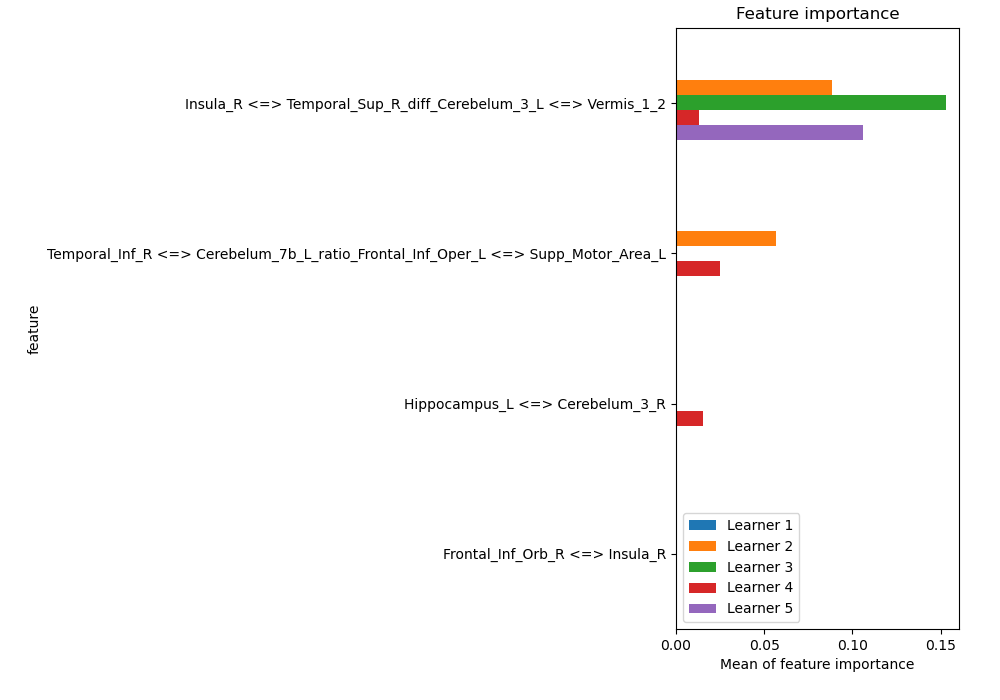
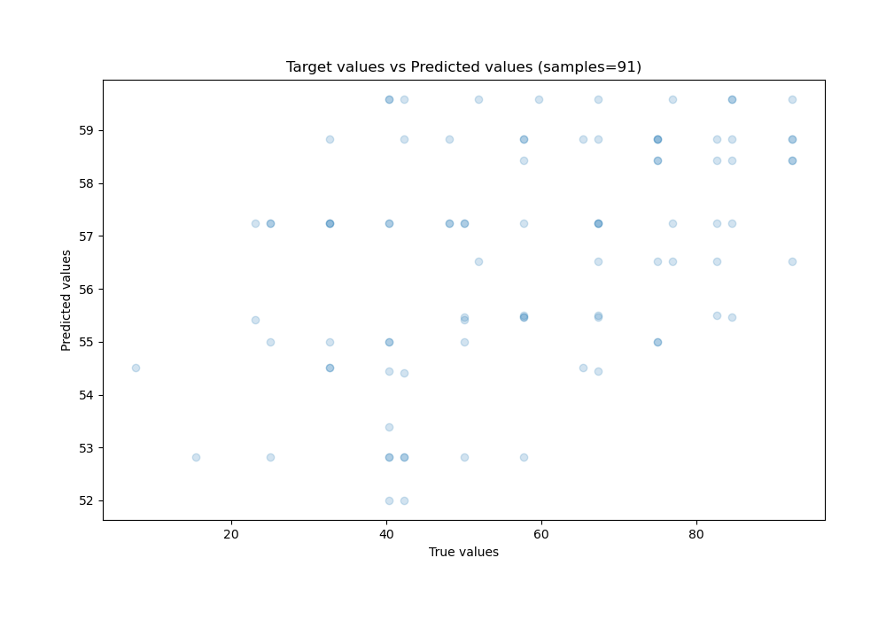
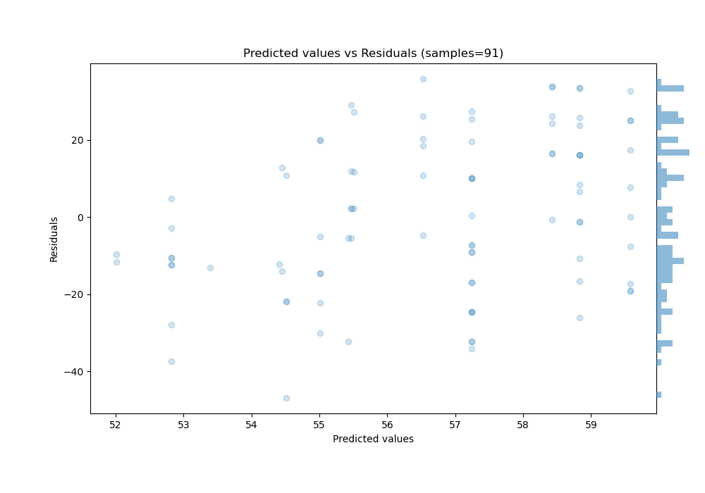

# Summary of 19_RandomForest_GoldenFeatures_SelectedFeatures

[<< Go back](../README.md)

## Random Forest
- **n_jobs**: -1
- **criterion**: squared_error
- **max_features**: 0.7
- **min_samples_split**: 50
- **max_depth**: 3
- **eval_metric_name**: rmse
- **explain_level**: 1

## Validation
 - **validation_type**: kfold
 - **k_folds**: 5
 - **shuffle**: True

## Optimized metric
rmse

## Training time

2.5 seconds

### Metric details:
| Metric   |       Score |
|:---------|------------:|
| MAE      |  17.2222    |
| MSE      | 403.707     |
| RMSE     |  20.0925    |
| R2       |   0.0781693 |
| MAPE     |   0.427521  |

## Learning curves

## Permutation-based Importance

## True vs Predicted

## Predicted vs Residuals

[<< Go back](../README.md)
