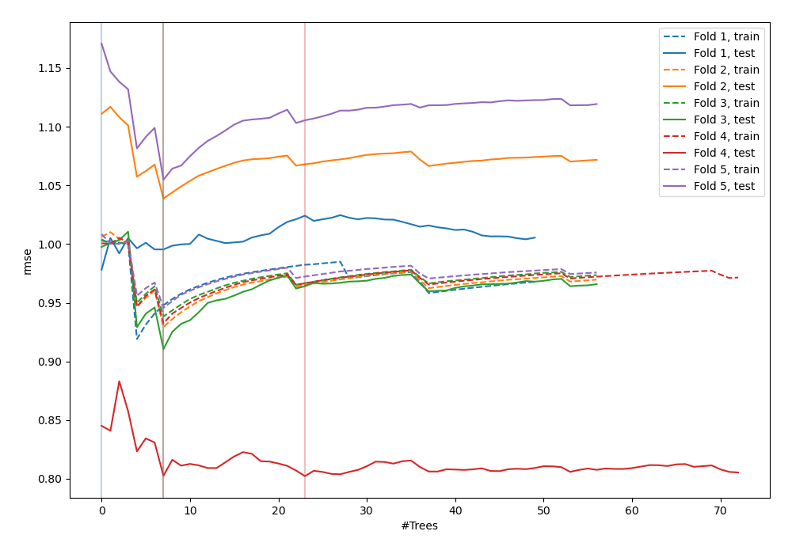
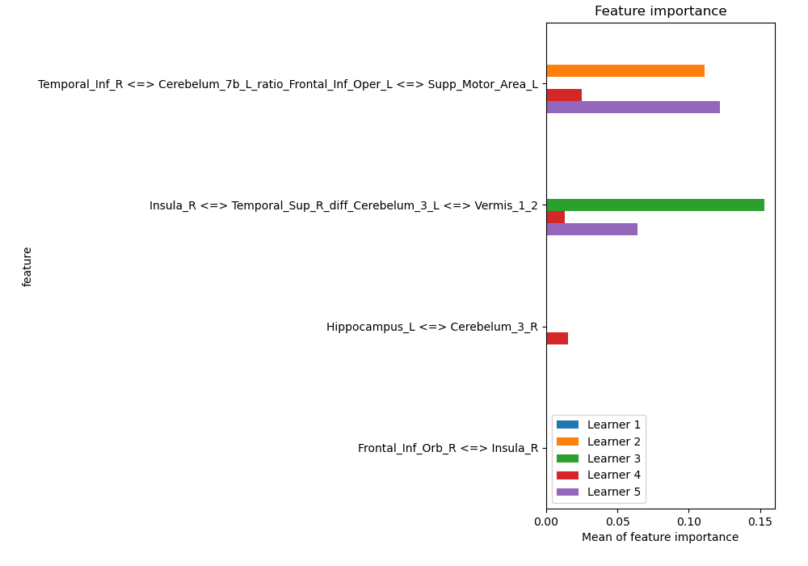
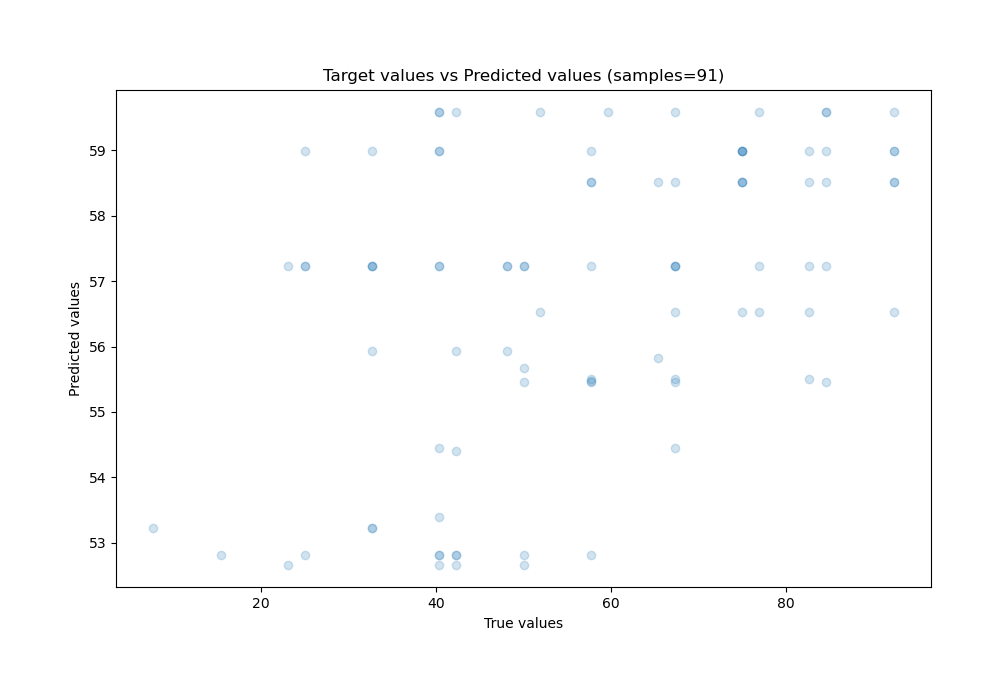
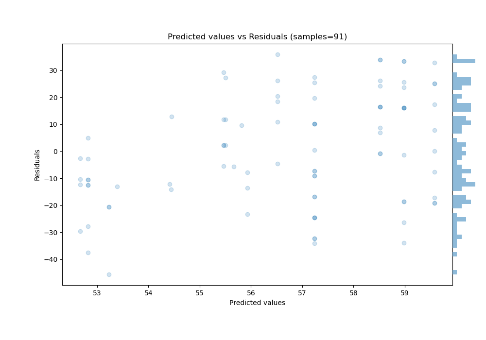

# Summary of 37_RandomForest_GoldenFeatures_SelectedFeatures

[<< Go back](../README.md)

## Random Forest
- **n_jobs**: -1
- **criterion**: squared_error
- **max_features**: 0.8
- **min_samples_split**: 50
- **max_depth**: 4
- **eval_metric_name**: rmse
- **explain_level**: 1

## Validation
 - **validation_type**: kfold
 - **k_folds**: 5
 - **shuffle**: True

## Optimized metric
rmse

## Training time

2.7 seconds

### Metric details:
| Metric   |       Score |
|:---------|------------:|
| MAE      |  17.1122    |
| MSE      | 400.161     |
| RMSE     |  20.004     |
| R2       |   0.0862657 |
| MAPE     |   0.424825  |

## Learning curves

## Permutation-based Importance

## True vs Predicted

## Predicted vs Residuals

[<< Go back](../README.md)
