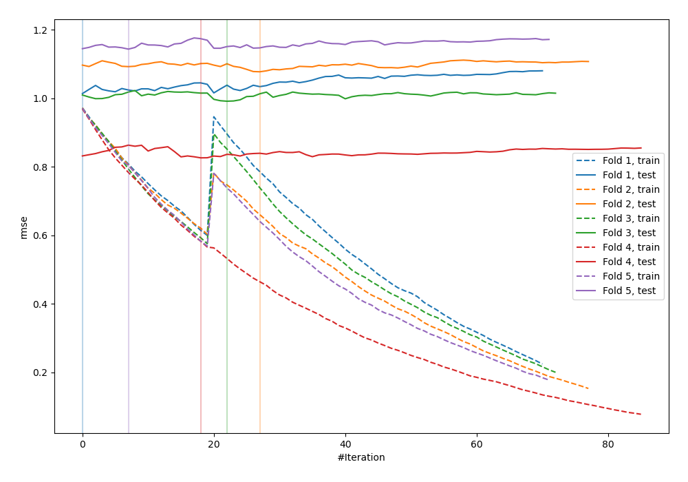
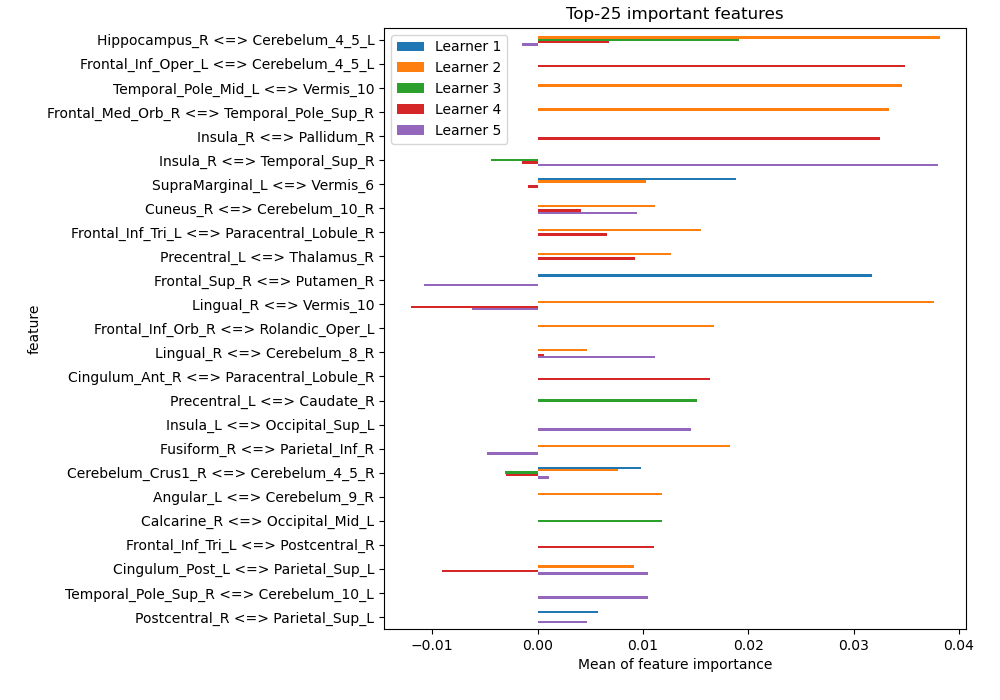
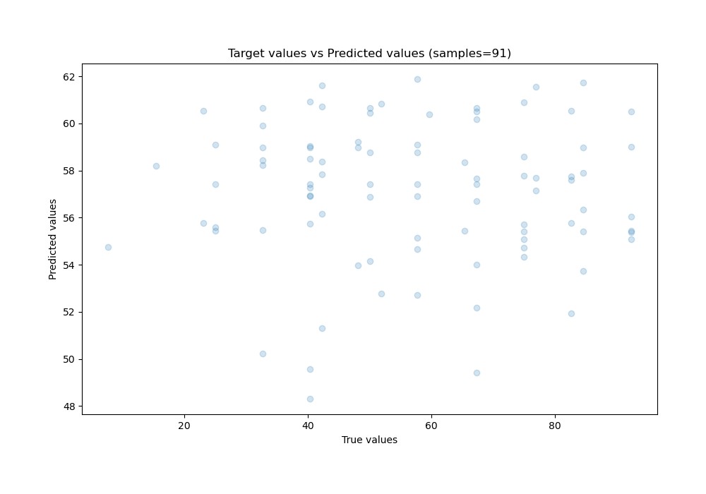
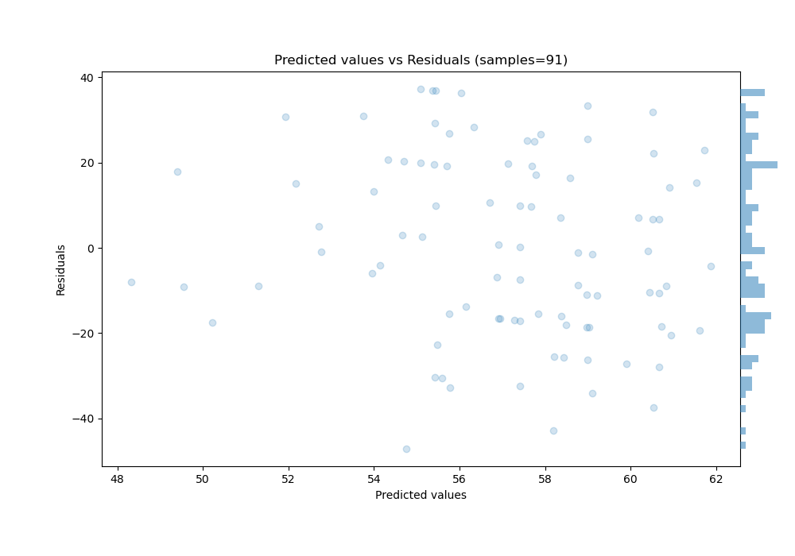

# Summary of 3_Default_CatBoost

[<< Go back](../README.md)

## CatBoost
- **n_jobs**: -1
- **learning_rate**: 0.1
- **depth**: 6
- **rsm**: 1
- **loss_function**: RMSE
- **eval_metric**: RMSE
- **explain_level**: 1

## Validation
 - **validation_type**: kfold
 - **k_folds**: 5
 - **shuffle**: True

## Optimized metric
rmse

## Training time

5936.8 seconds

### Metric details:
| Metric   |       Score |
|:---------|------------:|
| MAE      |  18.1867    |
| MSE      | 447.845     |
| RMSE     |  21.1623    |
| R2       |  -0.0226151 |
| MAPE     |   0.451628  |

## Learning curves

## Permutation-based Importance

## True vs Predicted

## Predicted vs Residuals

[<< Go back](../README.md)
