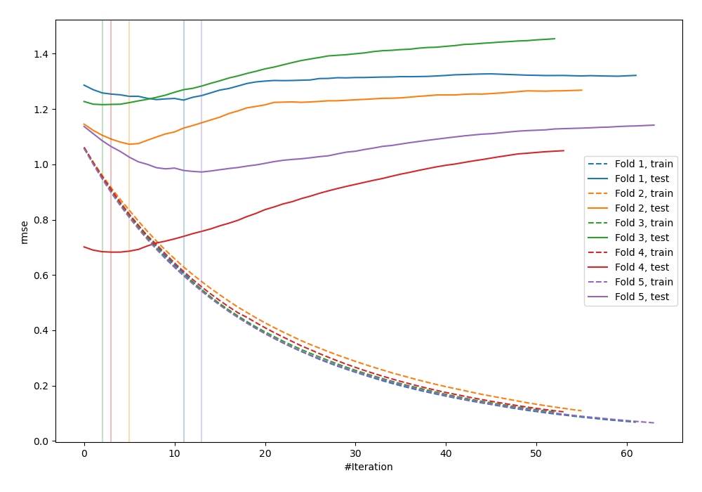
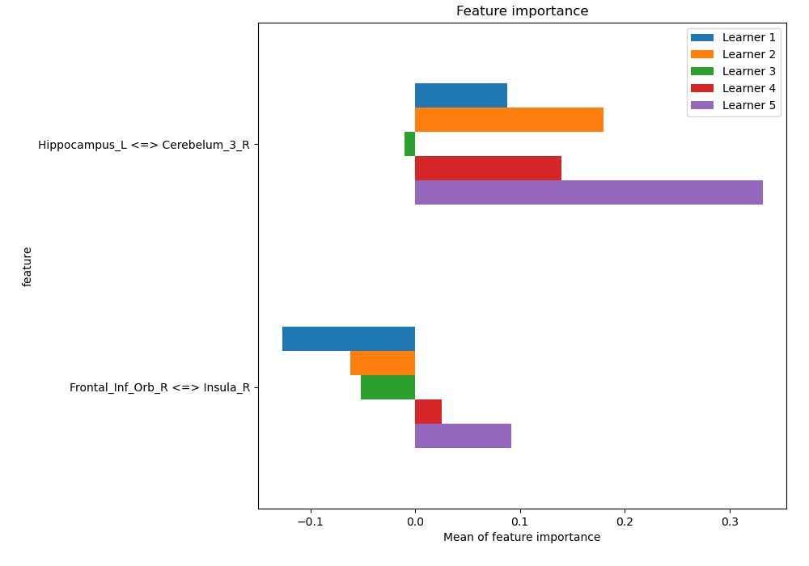
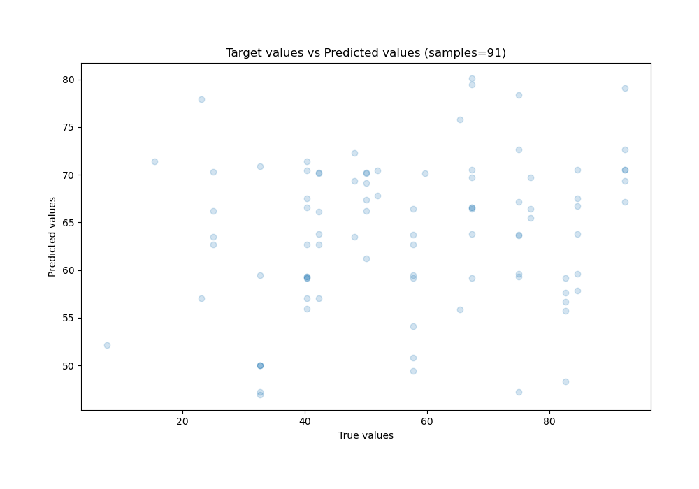
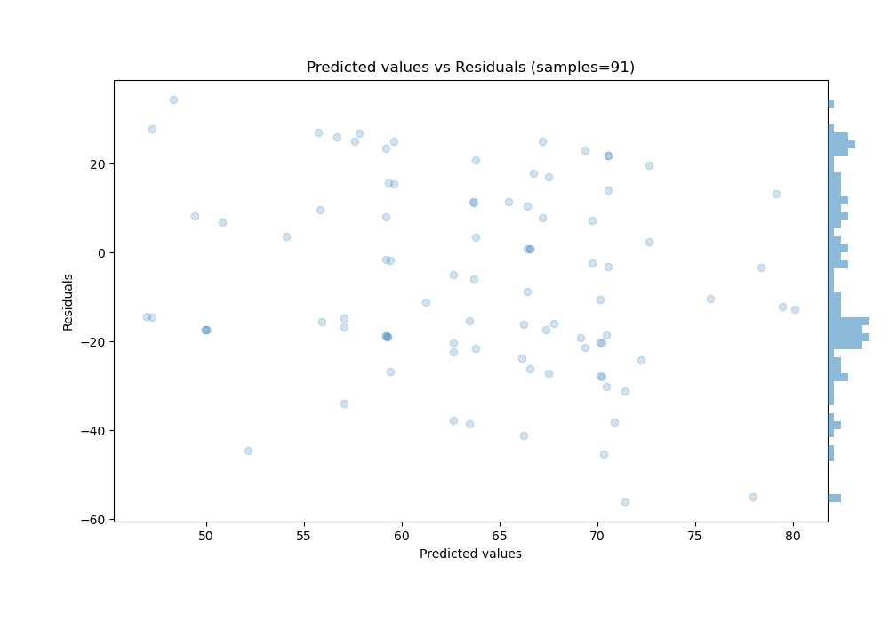

# Summary of 40_Xgboost_SelectedFeatures

[<< Go back](../README.md)

## Extreme Gradient Boosting (Xgboost)
- **n_jobs**: -1
- **objective**: reg:squarederror
- **eta**: 0.075
- **max_depth**: 9
- **min_child_weight**: 1
- **subsample**: 1.0
- **colsample_bytree**: 1.0
- **eval_metric**: rmse
- **explain_level**: 1

## Validation
 - **validation_type**: kfold
 - **k_folds**: 5
 - **shuffle**: True

## Optimized metric
rmse

## Training time

2.0 seconds

### Metric details:
| Metric   |      Score |
|:---------|-----------:|
| MAE      |  18.6899   |
| MSE      | 483.452    |
| RMSE     |  21.9875   |
| R2       |  -0.10392  |
| MAPE     |   0.499607 |

## Learning curves

## Permutation-based Importance

## True vs Predicted

## Predicted vs Residuals

[<< Go back](../README.md)
