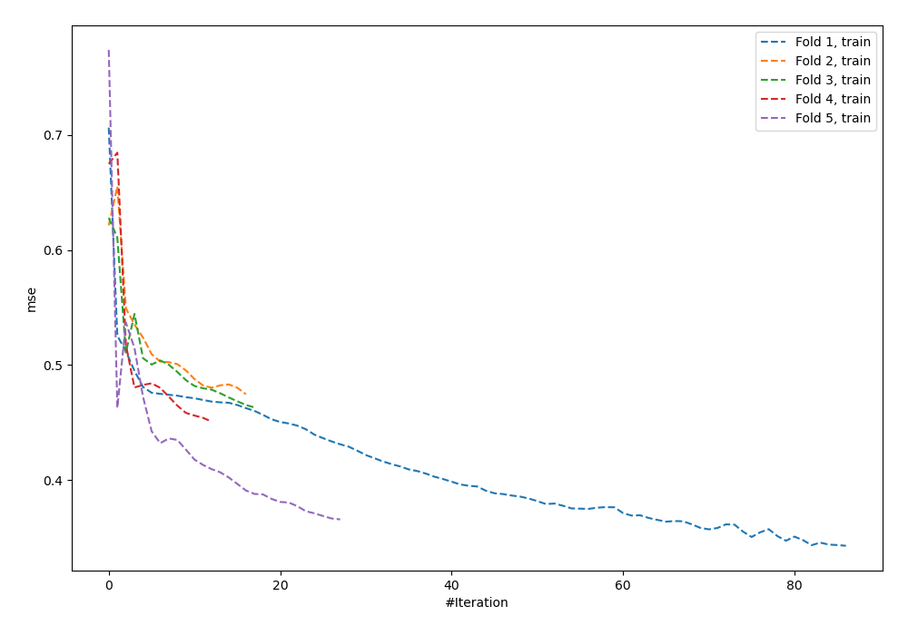
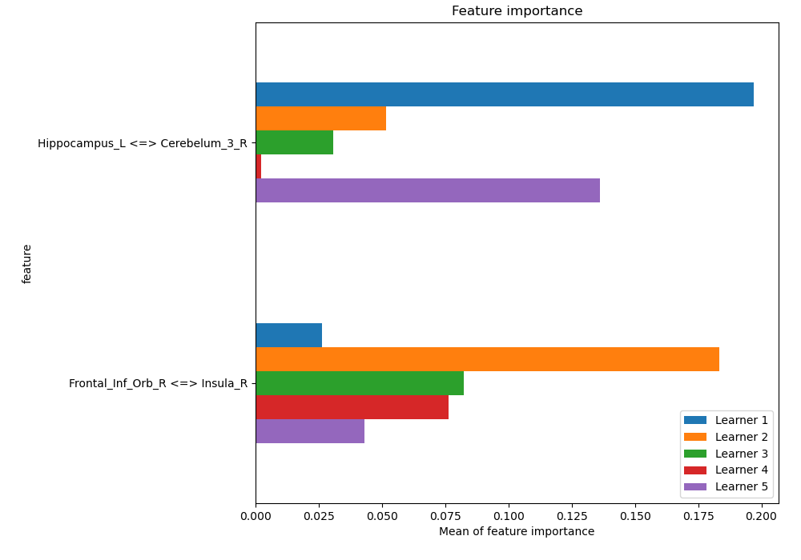
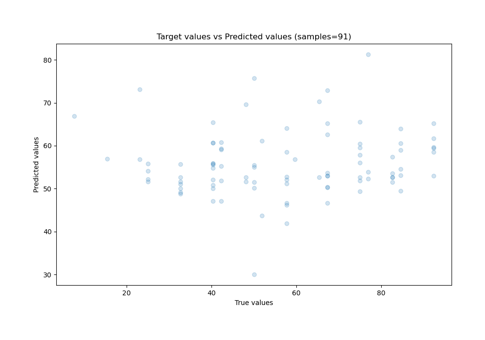
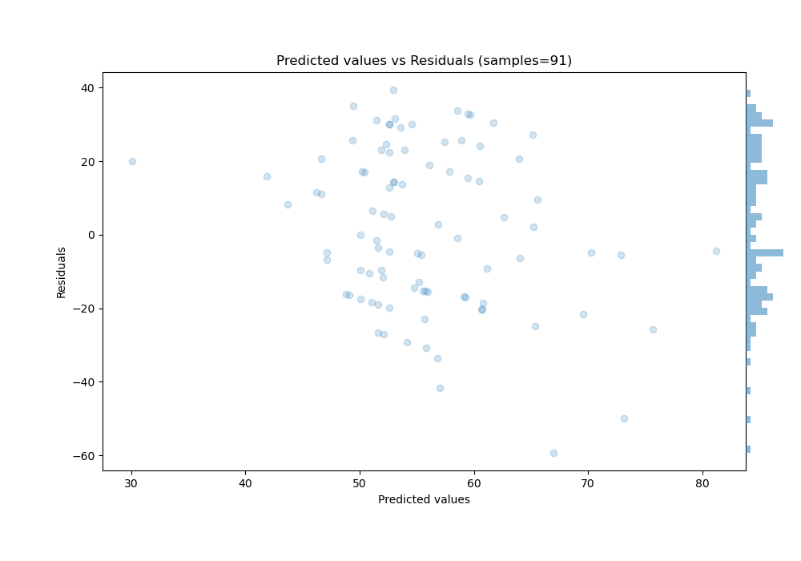

# Summary of 48_NeuralNetwork_SelectedFeatures

[<< Go back](../README.md)

## Neural Network
- **n_jobs**: -1
- **dense_1_size**: 32
- **dense_2_size**: 8
- **learning_rate**: 0.05
- **explain_level**: 1

## Validation
 - **validation_type**: kfold
 - **k_folds**: 5
 - **shuffle**: True

## Optimized metric
rmse

## Training time

3.7 seconds

### Metric details:
| Metric   |       Score |
|:---------|------------:|
| MAE      |  18.4325    |
| MSE      | 465.823     |
| RMSE     |  21.5829    |
| R2       |  -0.0636672 |
| MAPE     |   0.463138  |

## Learning curves

## Permutation-based Importance

## True vs Predicted

## Predicted vs Residuals

[<< Go back](../README.md)
