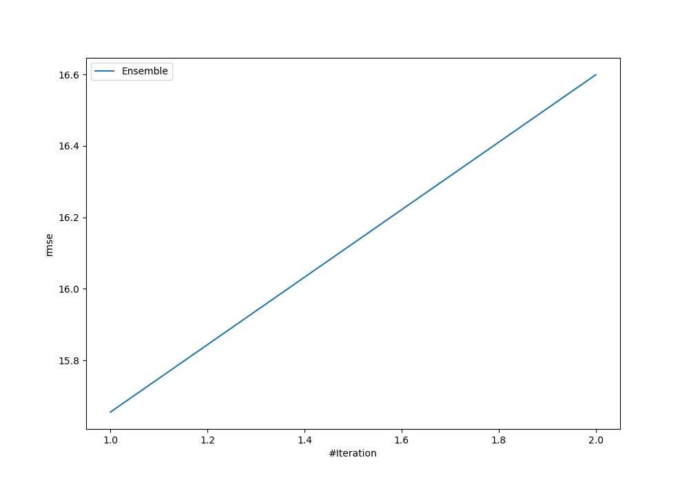
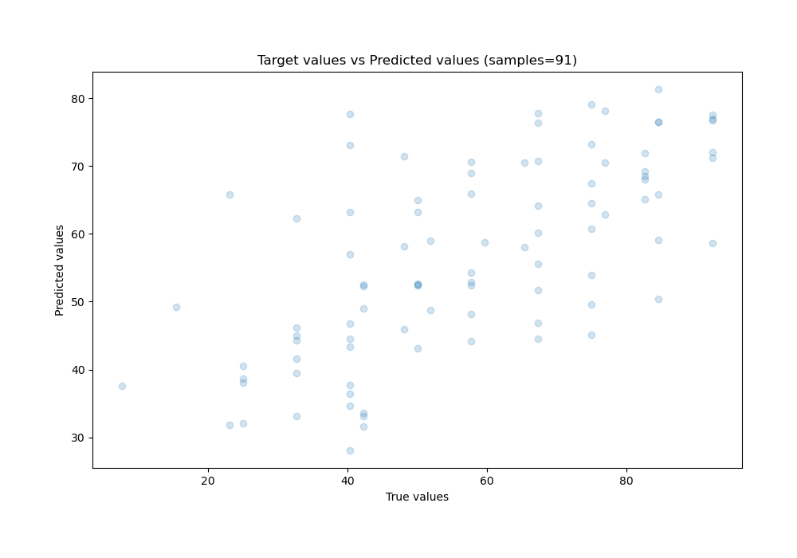
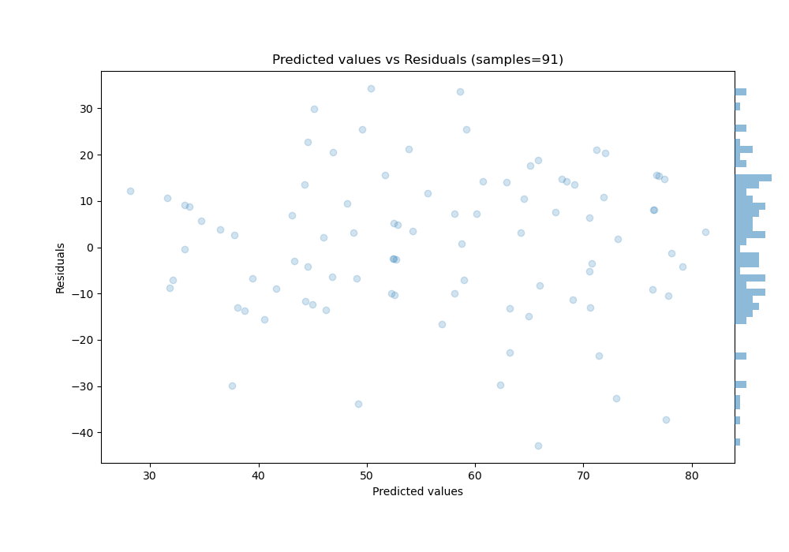

# Summary of Ensemble

[<< Go back](../README.md)

## Ensemble structure
| Model                                       |   Weight |
|:--------------------------------------------|---------:|
| 23_LightGBM_GoldenFeatures_SelectedFeatures |        1 |

### Metric details:
| Metric   |      Score |
|:---------|-----------:|
| MAE      |  12.653    |
| MSE      | 245.072    |
| RMSE     |  15.6548   |
| R2       |   0.440399 |
| MAPE     |   0.304021 |

## Learning curves

## True vs Predicted

## Predicted vs Residuals

[<< Go back](../README.md)
